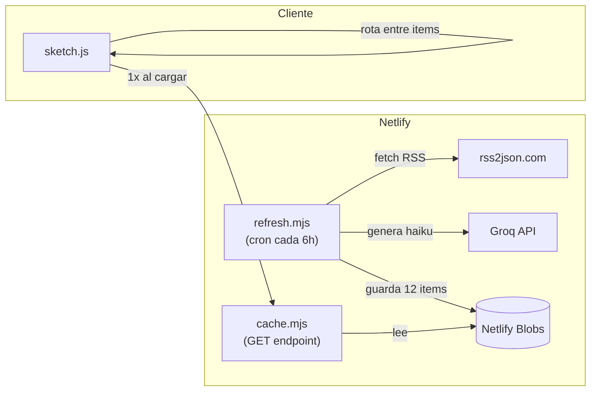

# News Haiku

Obtiene titulares apocalípticos de noticias en español y los transforma en un haiku, animado con física tipográfica.

[Live](https://news-to-haiku.netlify.app/)

[](https://app.netlify.com/projects/news-to-haiku/deploys)

Las letras del titular que no pertenecen al haiku pivotan y caen (Matter.js). Las que sí, se tiñen de rojo y viajan a su posición en el poema. Las letras del haiku que no existen en el titular aparecen como letras "fantasma" con fade-in.

El haiku es generado por Groq (Llama 3.3 70B) con fallback algorítmico basado en conteo silábico español.

## Correr en local

Se necesitan dos cosas corriendo en paralelo: un servidor estático para el sketch y el proxy para la API de Groq.

### 1. Proxy de API

El browser no puede llamar directamente a la API de Groq por restricciones CORS. El archivo `proxy-server.js` (excluido del repo) resuelve esto.

Crear el archivo `proxy-server.js` en la raíz del proyecto:

```javascript
const http = require("http");
const https = require("https");

const PORT = 3001;
const GROQ_API_URL = "https://api.groq.com/openai/v1/chat/completions";
const GROQ_API_KEY = "tu-api-key-aqui";

const server = http.createServer((req, res) => {
  res.setHeader("Access-Control-Allow-Origin", "*");
  res.setHeader("Access-Control-Allow-Methods", "POST, OPTIONS");
  res.setHeader("Access-Control-Allow-Headers", "Content-Type");

  if (req.method === "OPTIONS") { res.writeHead(204); res.end(); return; }
  if (req.method !== "POST" || req.url !== "/haiku") {
    res.writeHead(404); res.end("Not found"); return;
  }

  let body = "";
  req.on("data", chunk => { body += chunk; });
  req.on("end", () => {
    const postData = Buffer.from(body, "utf-8");
    const proxyReq = https.request(GROQ_API_URL, {
      method: "POST",
      headers: {
        "Content-Type": "application/json",
        "Authorization": "Bearer " + GROQ_API_KEY,
        "Content-Length": postData.length
      }
    }, (proxyRes) => {
      let respBody = "";
      proxyRes.on("data", chunk => { respBody += chunk; });
      proxyRes.on("end", () => {
        res.writeHead(proxyRes.statusCode, { "Content-Type": "application/json" });
        res.end(respBody);
      });
    });
    proxyReq.on("error", (err) => {
      res.writeHead(502, { "Content-Type": "application/json" });
      res.end(JSON.stringify({ error: err.message }));
    });
    proxyReq.write(postData);
    proxyReq.end();
  });
});

server.listen(PORT, () => console.log("Proxy en http://localhost:" + PORT + "/haiku"));
```

Ejecutar:

```
node proxy-server.js
```

API key gratuita en: https://console.groq.com/keys

### 2. Servidor estático

Con Live Server (VS Code) o cualquier servidor estático:

```
npx serve .
```

Abrir `http://localhost:3000` (o el puerto que asigne Live Server).

Sin el proxy corriendo, el sketch funciona igual pero usa el motor algorítmico en vez de Groq.

## Deploy en Netlify

El repo incluye una Netlify Function en `netlify/functions/haiku.js` que actúa como proxy en producción.

1. Conectar el repo en Netlify
2. En Site settings, Environment variables, agregar `GROQ_API_KEY` con la key de Groq
3. Push a main triggerea el deploy

## Cache de haikus

Para no sobreexigir la API de Groq, el sistema incluye un cache server-side.

Una funcion scheduled (`refresh.mjs`) se ejecuta cada 6 horas, busca titulares apocalipticos via RSS, genera haikus para los 12 mejores, y los almacena en Netlify Blobs. El cliente pide el cache una vez al cargar (`cache.mjs`) y rota entre los items pre-generados sin tocar la API.

El archivo `cache.json` commiteado en el repo sirve como fallback estático para el primer deploy (antes de que el cron haya corrido). Una vez que `refresh.mjs` corre por primera vez, los Blobs toman prioridad con noticias frescas.



Si el cache esta vacio (primera vez, o en desarrollo local), el sketch cae al flujo original: RSS + Groq en tiempo real.

Para forzar un refresco manual del cache, hacer POST a `/.netlify/functions/refresh`.

## Estructura

```
index.html                      Entrada, carga fuentes y scripts
sketch.js                       Animacion p5.js + Matter.js (estado, dibujo, fisica)
haiku.js                        Generador de haiku (Groq/Llama + fallback algoritmico)
silabas.js                      Conteo silabico español (diptongos, hiatos)
noticias.js                     Fetch de titulares via RSS
js/p5.min.js                    p5.js
js/matter.js                    Matter.js 0.12.0
netlify/functions/haiku.js      Proxy para Groq (fallback en tiempo real)
netlify/functions/refresh.mjs   Scheduled: genera cache cada 6h
netlify/functions/cache.mjs     Sirve el cache al cliente
cache.json                      Fallback estatico (commiteado)
netlify.toml                    Configuracion de Netlify
package.json                    Dependencia @netlify/blobs
```
